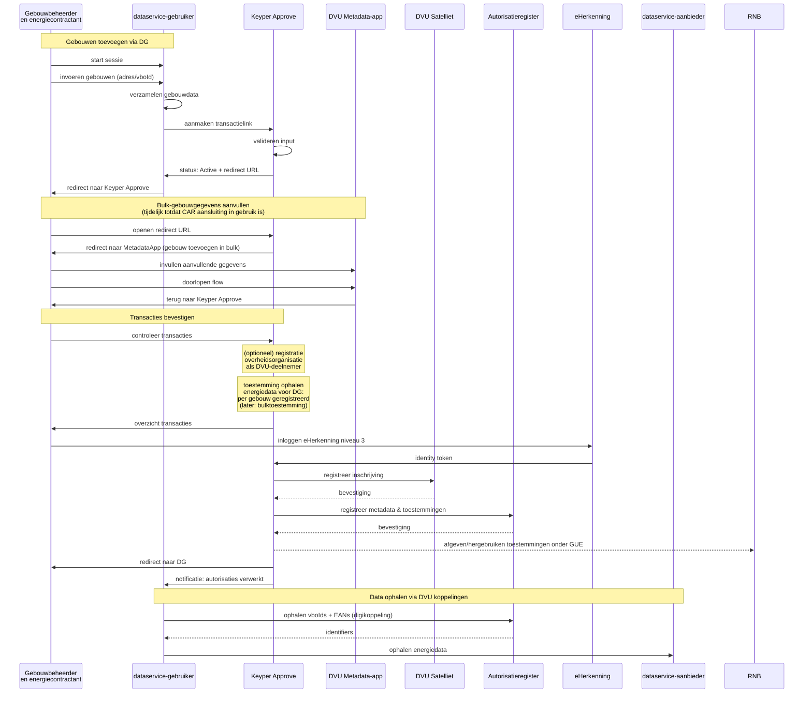

# DVU Implementation Context

## Quick Links
- [🏠 Add single building](context.md)
- [🏘️ Add multiple buildings](gebouwen-in-bulk.md)

> **Status:** Work in progress

## Sequence diagram toegang aanvragen tot gebouwen in bulk

De onderstaande sequence toont het DVU goedkeuringsproces voor meerdere gebouwen tegelijk.

