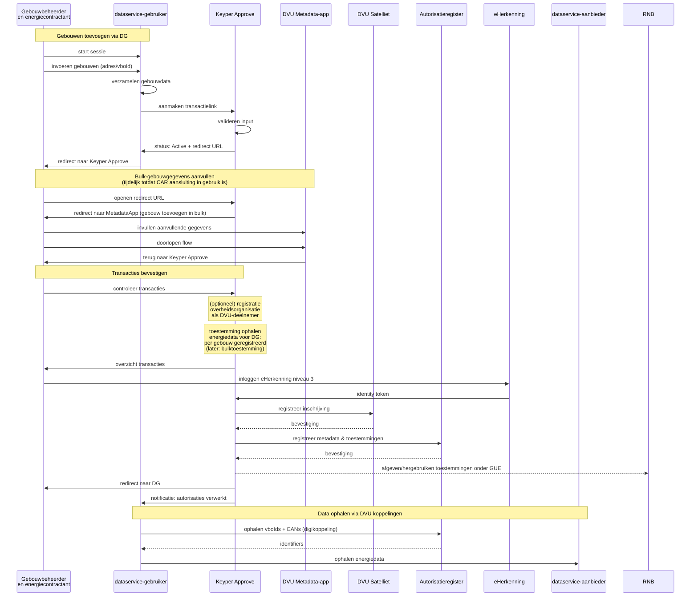

# DVU Implementatie: meerdere gebouwen toevoegen vanuit externe datadienst

## Implementatie-instructie Keyper Approve voor DVU diensten: Toestemming voor Energiedata van meerdere gebouwen via DVU

### Doel

Gebruikers van een applicatie moeten toestemming vragen aan de energiecontractant om energiedata op te halen.

---

### Stap 1: Formulier op de website

Voor bulk gebouwen toevoegen heeft EED een uitgebreid formulier nodig voor het verzamelen van meerdere gebouwadressen.

#### Velden aanvrager (invullend persoon)

- E-mailadres
- Organisatie
- Organisatie-id (EORI, voorbeeld: EU.EORI.NL860730499)

#### Velden energiecontractant (approver via Keyper Approve)

- E-mailadres
- Organisatie
- Organisatie-id (EORI, voorbeeld: EU.EORI.NL860730499)

#### Velden gebouwen (bulk invoer)

- **Adreslijst**: Meerdere adressen kunnen worden toegevoegd
  - Per adres: Postcode + Huisnummer (bijv. "3013 AK 45")

**Validatie vereist**: E-mail, EORI-nummer, en minimaal één geldig adres. Client-side validatie wordt sterk aanbevolen voor gebruikerservaring.

---

### Stap 2: Aanroepen van de Keyper API

[https://keyper-preview.poort8.nl/scalar/#tag/approval-links/POST/api/approval-links](https://keyper-preview.poort8.nl/scalar/#tag/approval-links/POST/api/approval-links)

Bij formulierverzending stuur je een POST-verzoek naar:

```
POST https://keyper-preview.poort8.nl/api/approval-links
Content-Type: application/json
```

#### JSON-body voorbeeld voor DVU bulk gebouwen op basis van formulierinvoer

```json
{
  "authenticationMethods": ["eherkenning"],
  "requester": {
    "email": "<EMAIL_AANVRAGER>",
    "organization": "<ORGANISATIE_AANVRAGER>",
    "organizationId": "<EORI_AANVRAGER>"
  },
  "approver": {
    "email": "<EMAIL_ENERGIECONTRACTANT>",
    "organization": "<ORGANISATIE_ENERGIECONTRACTANT>",
    "organizationId": "<EORI_ENERGIECONTRACTANT>"
  },
  "dataspace": {
    "name": "dvu",
    "policyUrl": "https://dvu-test.azurewebsites.net/api/policies/",
    "organizationUrl": "https://dvu-test.azurewebsites.net/api/organization-registry/__ORGANIZATIONID__",
    "resourceGroupUrl": "https://dvu-test.azurewebsites.net/api/resourcegroups/"
  },
  "description": "Keyper approve link voor bulk gebouwen - EED",
  "reference": "<EIGEN_REF>",
  "expiresInSeconds": "<GELDIGHEID>",
  "redirectUrl": "<VERWIJS_URL_EINDE_FLOW>",
  "orchestration": {
    "flow": "dvu.voeg-gebouwen-toe@1",
    "payload": {
      "addresses": ["3013 AK 45", "3161 GD 7a", "3161 GD 7b"]
    }
  }
}
```

**Belangrijke orchestration configuratie**:
- **`flow`**: `"dvu.voeg-gebouwen-toe@1"` activeert de bulk gebouwen metadata flow
- **`payload.addresses`**: Array van adressen in formaat "postcode huisnummer"
- **Automatische redirect**: Keyper detecteert de flow en leidt gebruikers automatisch naar DVU metadata-app

**Verwacht gedrag**:
1. Na aanmaken krijgt EED een approval link terug met status "Active"
2. Wanneer de approver de link opent, wordt deze automatisch doorgeleid naar DVU metadata-app
3. In de DVU app kan de approver de bulk gebouwen toevoegen met aanvullende gegevens
4. Na voltooien keert de gebruiker terug naar Keyper Approve voor finale goedkeuring

- Gebruik URL encoding voor het adres in `redirectUrl`.
- Het respons-object bevat een veld “status”. Als deze “Active” is, dan is de link succesvol aangemaakt. De approver wordt  automatisch per email om reactie verzocht.
- Kies een geldigheid (in seconden) voor hoe lang de link actief is, bijvoorbeeld 1 week (604.800 seconden).
- Gebruik een referentie voor gebruik in de app.

## Sequence diagram toegang aanvragen tot gebouwen in bulk

De onderstaande sequence toont het DVU goedkeuringsproces voor meerdere gebouwen tegelijk.


