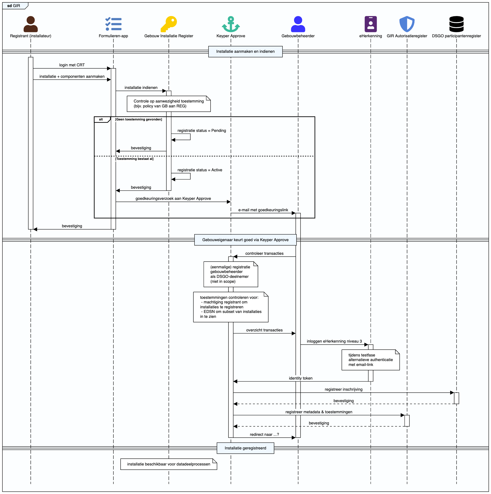

# GIR Implementation Context
De Gebouw Installatie Registratie API (GIR) is ontworpen om gebouwbeheerders in staat te stellen installatiegegevens te registreren, toegangsrechten te beheren en beveiligde gegevensuitwisseling mogelijk te maken met geautoriseerde dataverbruikers, zoals bijvoorbeeld EDSN (Energie Data Services Nederland). De API ondersteunt autorisatiebeheer en een naadloze verwerking van installatiegegevens.

## Belangrijkste functies van de GIR applicatie:
DSGO Autorisatieregister: Geeft gebruikers de mogelijkheid om rechten in te stellen voor installatiebedrijven of andere registranten en voor dataverbruikers om gebouwinstallatiegegevens te bekijken en te beheren.
Installatieregistratie en metadataverwerking: Ondersteunt installatiebedrijven bij het registreren en bijwerken van installatiedetails, waarmee dataverbruikers deze gegevens kunnen ophalen en analyseren.

## Installatie registratie (Happy flow)
1. Registratie installatie door de registrant (via eigen applicatie, bijvoorbeeld de Formulierenapp): Deze stap stelt installatiebedrijven in staat om in te loggen, registratieformulieren te openen, installatiegegevens in te dienen (zoals installatietype en locatie) en de succesvolle registratie te bevestigen. De app van de registrant registreert eerst installaties, die op 'pending' status komen te staan indien de juiste toestemmingen er nog niet zijn.
2. Aanvragen goedkeuring door registrant (via eigen applicatie, bijvoorbeeld de Formulierenapp): De app van de registrant creëert een approval-link in Keyper Approve. Daarin worden alle benodigde dataspace transacties opgenomen (inschrijving organisatie, toestemmingen). Deze link wordt gebruikt om de benodigde goedkeuringen te verkrijgen van de installatie-eigenaar. Keyper is een aparte applicatie die volgens de DSGO standaarden toestemmingsaanvragen en andere transacties in DSGO dataspaces verwerkt, waarmee de integriteit en geldigheid van alle goedkeuringsverzoeken wordt gewaarborgd.
3. Controle approval-link door Keyper Approve: Keyper Approve controleert de approval-link. Als alle transacties geldig kunnen worden verwerkt, wordt de approval-link 'Active'. Deze status stuurt Keyper Approve terug in het response op de call POST /api/approval-links. Als er transacties niet geldig zijn, geeft het status-veld in de response aan wat er met de transacties mis is. De approval-link kan dan niet worden gebruikt.
4. Mailverzoek aan installatie-eigenaar door Keyper Approve: Voor een geldige 'Active' approval-link wordt een e-mail verstuurd naar de installatie-eigenaar met een link naar de Approval flow waarmee de eigenaar deze transacties kan controleren en bevestigen.
5. Bevestiging na authenticatie via eHerkenning: Dit stelt gebruikers in staat om veilig in te loggen en hun identiteit als vertegenwoordigers van hun organisaties te verifiëren. Na goedkeuring worden de gegevens beschikbaar voor geautoriseerde dataverbruikers.
6. Ophalen van installatie-metadata door dataverbruiker: Dataverbruikers kunnen gegevens waarvoor zij geautoriseerd zijn opvragen en ophalen. Deze stroom handhaaft toegangsrechten zoals deze door de gegevenseigenaar zijn beheerd.
7. Ophalen relevante productdata: Met de opgehaalde installatie-metadata kan de datadienstgebruiker vervolgens naar diens specifieke informatiebehoefte bij 2BA de relevante productdata over de installaties (conform ETIM-standaard) ophalen, zie 2BA ETIMFeaturesValues (API).

Bron: [API documentatie DICO standaard GIR Basisdata Message](https://ketenstandaard.semantic-treehouse.nl/docs/api/GIR/)

## Keyper Approve integration for the Gebouw Installatie Register: permissions to register and retrieve installations

The GIR (Gebouw Installatie Register) requires explicit consent from the building owner before a registrant can submit installation data. The sequence below illustrates the approval process.

### Doel

Gebruikers van een applicatie moeten toestemming vragen aan de energiecontractant om energiedata op te halen. Dit gebeurt via een formulier op de website van de applicatie en een achterliggende API-call naar Keyper Approve.

---

### Stap 1: Registration of an installation

Verzamel in de FormulierenApp de gegevens die nodig zijn om de
approval‑link op te bouwen:

#### Velden registrant

- KvK-nummer van de registrant (`{{registrarChamberOfCommerceNumber}}`)
- E-mailadres van de registrant (`{{requesterEmail}}`)
- Installatie-ID (`{{installationID}}`)
- VBO-ID (`{{vboID}}`)

#### Velden installatie-eigenaar

- E-mailadres (`{{approverEmail}}`)
- KvK-nummer van de eigenaar (`{{installationOwnerChamberOfCommerceNumber}}`)

Deze waardes vult de applicatie in de JSON-body van stap&nbsp;2.

### Stap 2: Aanroepen van de Keyper API

[https://keyper-preview.poort8.nl/scalar/#tag/approval-links/POST/api/approval-links](https://keyper-preview.poort8.nl/scalar/#tag/approval-links/POST/api/approval-links)

Bij formulierverzending stuur je een POST-verzoek naar:

```
POST https://keyper-preview.poort8.nl/api/approval-links
Content-Type: application/json
```

#### JSON-body voorbeeld voor GIR op basis van informatie registrant

Create an approval link via the Keyper API using the following template. Replace the placeholders with values from your own application.

```json
{
  "addPolicyTransactions": [
    {
      "useCase": "GIR",
      "issuedAt": 1739881378,
      "notBefore": 1739881378,
      "expiration": 1839881378,
      "issuerId": "NL.KVK.{{installationOwnerChamberOfCommerceNumber}}",
      "subjectId": "NL.KVK.{{registrarChamberOfCommerceNumber}}",
      "serviceProvider": "NL.KVK.27248698",
      "action": "write",
      "resourceId": "{{vboID}}",
      "type": "vboID",
      "attribute": "{{installationID}}",
      "license": "0005"
    },
    {
      "useCase": "GIR",
      "issuedAt": 1739881378,
      "notBefore": 1739881378,
      "expiration": 1839881378,
      "issuerId": "NL.KVK.{{installationOwnerChamberOfCommerceNumber}}",
      "subjectId": "NL.KVK.39098825",
      "serviceProvider": "NL.KVK.27248698",
      "action": "read",
      "resourceId": "{{vboID}}",
      "type": "vboID",
      "attribute": "*",
      "license": "0005",
      "rules": "Classificaties(NLSfB-55.21,NLSfB-56.21,NLSfB-61.15,NLSfB-62.32,NLSfB-61.18)"
    }
  ],
  "requester": {
    "email": "{{requesterEmail}}",
    "organization": "{{registrarChamberOfCommerceNumber}}",
    "organizationId": "{{registrarChamberOfCommerceNumber}}"
  },
  "approver": {
    "email": "{{approverEmail}}",
    "organization": "{{installationOwnerChamberOfCommerceNumber}}",
    "organizationId": "{{installationOwnerChamberOfCommerceNumber}}"
  },
  "dataspace": {
    "name": "DSGO",
    "Use case": "GIR"
  },
  "description": "GIR installation registration approval",
  "reference": "<your reference>",
  "expiresInSeconds": 604800,
  "redirectUrl": "https://www.technieknederland.nl"
}
```

## Sequence diagram Gebouw Installatie Registratie



```plantuml
@startuml
!theme plain
entryspacing 0.7

frame #f0f8ff GIR

fontawesome5solid f007 "Registrant (installateur)" as REG #512a19
fontawesome5solid f0ae "Formulieren-app" as FormApp #517dbf
fontawesome5solid f084 "Gebouw Installatie Register" as GIR #fbce00
fontawesome5solid f13d "Keyper Approve" as KA #3bba9c
fontawesome5solid f007 "Gebouwbeheerder" as GB #3933ff
fontawesome5solid f2c1 "eHerkenning" as Eherkenning #592874
fontawesome5solid f3ed "GIR Autorisatieregister" as AR #5182d8
fontawesome5solid f1c0 "DSGO participantenregister" as DSGO PR

== Installatie aanmaken en indienen == #f0f8ff
activate REG
REG->FormApp: login met CRT
activate FormApp
REG->FormApp: installatie + componenten aanmaken
FormApp->GIR: installatie indienen
activate GIR
note over GIR: Controle op aanwezigheid toestemming\n(bijv. policy van GB aan REG)
alt Geen toestemming gevonden
GIR->GIR: registratie status = Pending
GIR->FormApp: bevestiging

else Toestemming bestaat al
GIR->GIR: registratie status = Active
GIR->FormApp: bevestiging
deactivate GIR
FormApp->KA: goedkeuringsverzoek aan Keyper Approve
KA->GB: e-mail met goedkeuringslink
activate GB
end
FormApp->REG: bevestiging
deactivate FormApp
deactivate REG

== Gebouweigenaar keurt goed via Keyper Approve == #f0f8ff
GB->KA: controleer transacties
activate KA
note over KA: (eenmalige) registratie \ngebouwbeheerder\nals DSGO-deelnemer\n(niet in scope)
note over KA: toestemmingen controleren voor:\n - machtiging registrant om\ninstallaties te registreren\n - EDSN om subset van installaties\nin te zien

KA->GB: overzicht transacties
GB->Eherkenning: inloggen eHerkenning niveau 3
activate Eherkenning
note over Eherkenning: tijdens testfase\nalternatieve authenticatie\nmet email-link
Eherkenning->KA: identity token
deactivate Eherkenning
KA->DSGO PR: registreer inschrijving
activate DSGO PR
DSGO PR-->KA: bevestiging
deactivate DSGO PR

KA->AR: registreer metadata & toestemmingen
activate AR
AR-->KA: bevestiging

deactivate AR
KA->GB: redirect naar ...?
deactivate GB
deactivate KA

== Installatie geregistreerd == #f0f8ff
note over GIR: installatie beschikbaar voor datadeelprocessen
@enduml
```

